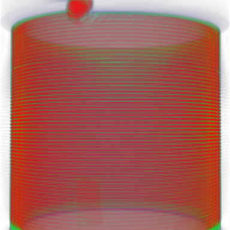
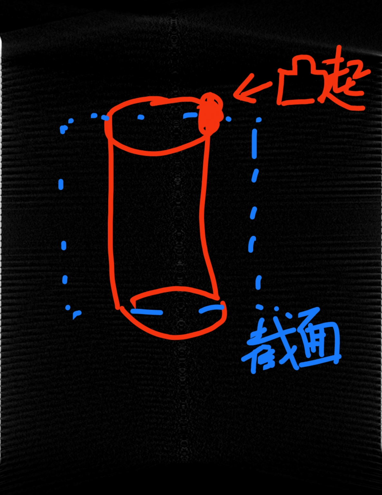
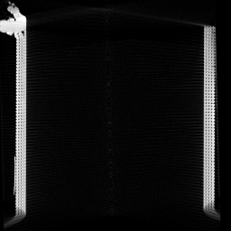

# CT-3D-image-detection

一、 问题描述

    输入：.raw格式的三维CT图像

    输出：array格式的距离
    

二、方法

    1、将3D数据保存为.npy的三维数据

    2、提取带有缺陷的切面图像
        2-1 从某一z坐标切出的图片进行圆检测，求出圆心坐标
        2-2 从某一z坐标切出的图片进行缺陷检测，求出缺陷点坐标
        2-3 根据圆心坐标和缺陷点坐标计算旋转变换矩阵
        2-4 固定z轴旋转整个3维模型至带缺陷点的切面与y轴平行
        2-5 切出带有缺陷点的切面图像

    3、从切面图像中求距离矩阵
